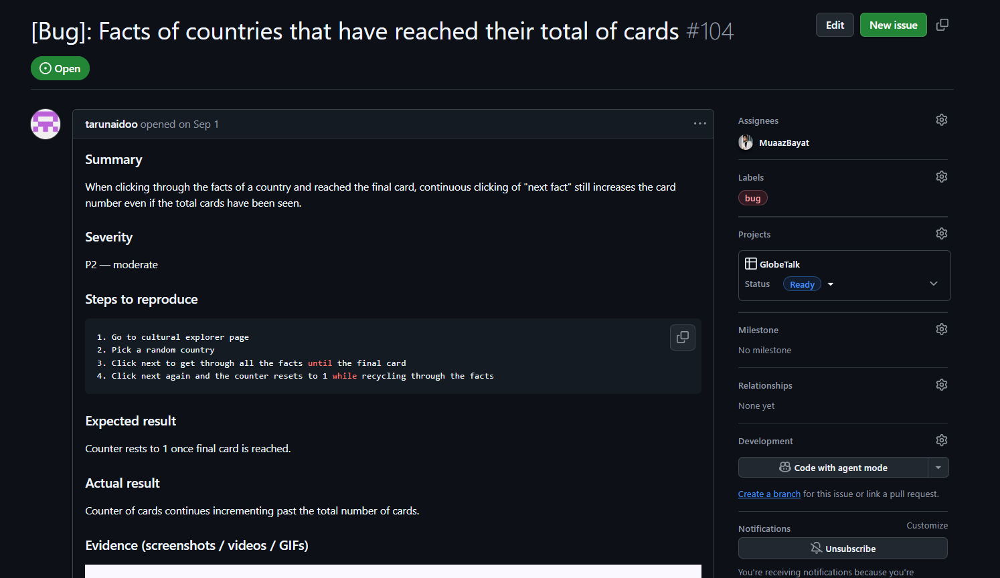
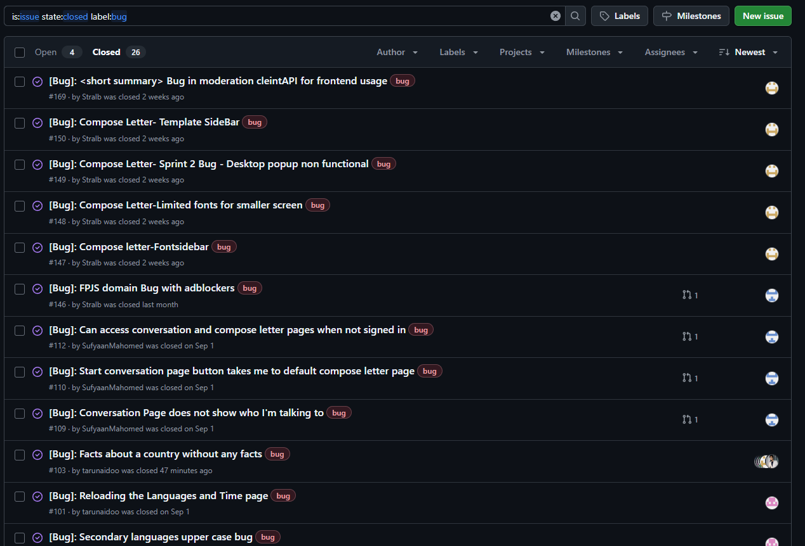
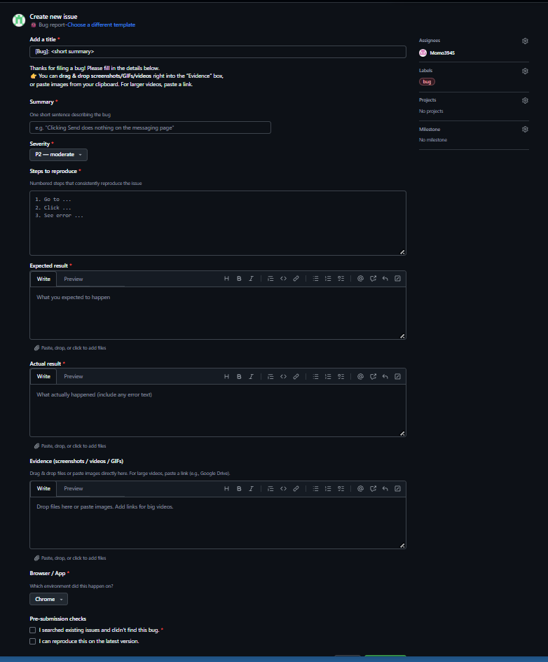

# Bug Tracker — GitHub Projects

Our project uses **GitHub Issues + GitHub Projects** as a centralized bug tracker. This ensures every defect is logged, prioritized, assigned, fixed, and verified in a consistent, auditable workflow.

---

## How It Works (Lifecycle)

1. **Report**

   * **Team**: file a GitHub Issue directly.
   * **External testers**: submit the Google Form; the team converts entries into GitHub Issues.
2. **Track**

   * All bugs become **Issues** and are added to the **Project board** (Backlog column).
3. **Triage**

   * Weekly (or ad‑hoc for critical bugs), the team assigns **severity**, **priority**, **labels**, and an **owner**.
4. **Fix**

   * Assignee works on a branch; a PR references the issue (`Closes #123`) using **Conventional Commits**.
5. **Verify**

   * After merge, QA/dev reproduces on the target environment and marks the issue **Verified**.
6. **Close**

   * Issue is moved to **Done** on the Project board.

---

## Severity & Priority

* **Severity** (impact):

  * **S0 – Critical**: crash/data loss/security; blocks release
  * **S1 – Major**: core feature broken; no simple workaround
  * **S2 – Moderate**: partial feature break; workaround exists
  * **S3 – Minor**: cosmetic/typo; no functional impact
* **Priority** (urgency): **P0** (now), **P1** (this sprint), **P2** (next), **P3** (backlog)

> Severity is user impact; priority is when we’ll fix it.

---

## Required Issue Fields (Evidence‑friendly)

Use this structure when creating a bug. It accelerates triage and verification.

* **Title**: concise problem statement (e.g., *Inbox shows empty cards on first load*)
* **Environment**: OS, browser/app version, branch/commit hash, environment (local/staging/prod)
* **Steps to Reproduce**: numbered, minimal steps
* **Expected Result**: what should happen
* **Actual Result**: what happens instead (include error text)
* **Artifacts / Evidence**:

  * Screenshots/GIF or **short screen recording**
  * Logs/console output
  * API proof (cURL/Postman) with **request+response** (status code, payload)
  * **Test references**: failing test name or CI run link
* **Scope**: affected service(s) (frontend, core, matchmaking, messaging, moderation)
* **Labels**: `type:bug`, `sev:S1`, `prio:P1`, `area:messaging`, `status:triage`

**Markdown template**

```md
### Environment
- App version/commit:
- Env: local/staging/prod
- Browser/OS:

### Steps to Reproduce
1.
2.
3.

### Expected

### Actual

### Artifacts / Evidence
- Screenshot/GIF:
- Logs:
- API proof (cURL/Postman):
- CI run / failing test:

### Scope
- Services:
- Labels:
```

---

## Board Columns (Suggested)

* **Backlog** → **Triage** → **Ready** → **In Progress** → **In Review** → **Verify** → **Done**

Automation tips:

* Move to **In Review** when a PR referencing the issue opens.
* Auto‑close issue on merge if PR includes `Closes #<id>`.

---

## Triage Cadence & SLAs

* **Cadence**: at least **weekly** triage; daily for **S0/S1** until resolved.
* **Target SLAs**:

  * **S0**: fix/mitigate within **24h**
  * **S1**: fix within **2–3 days**
  * **S2**: address within **1 sprint**
  * **S3**: backlog; group for batch fixes

---

## Evidence & Cross‑References

When closing a bug, attach evidence and link supporting docs:

* **Testing docs**: UI and API evidence capture → see **Unified Testing Guide — Jest & Pytest** and **Running Tests — CI/CD Automation** (coverage gates)
* **Stakeholder & Sprint docs**: reference the **Stakeholder Meetings — Summary & Evidence Plan** when the bug originated from feedback
* **Design/Architecture**: if relevant, link to decision records justifying a chosen fix

> This process ensures defects are tracked formally and resolved in a structured manner, maintaining quality and stability.

---

All bugs are tracked using this workflow and linked directly to our Sprint board in GitHub Projects.  
The following evidence illustrates this process in action.

## Evidence — GitHub Projects & Issue Tracker


The following screenshots provide direct proof of our structured, evidence-based bug tracking workflow in GitHub.

### 1. Individual Bug Report Example


*Example issue:*  
**"[Bug]: Facts of countries that have reached their total of cards (#104)"**  
Shows severity (**P2 — moderate**), clear *Steps to Reproduce*, *Expected vs Actual* results, and evidence placeholders.  
**Significance:** Demonstrates adherence to the required issue template and consistent metadata (assignee, labels, project link).

---

### 2. Bug in Project Board Workflow


Shows the issue lifecycle across **Ready → In Progress → In Review** columns.  
**Significance:** Confirms that bugs are tracked and progressed systematically through the GitHub Projects board.

---

### 3. Closed Bugs List (Evidence of Resolution)


Displays the **Closed** tab of GitHub Issues filtered by `label:bug`.  
**Significance:** Verifies that bugs are actively resolved and closed after verification — confirming end-to-end lifecycle adherence.

---

### 4. Issue Template — Structured Reporting


**Significance:** Provides proof of a standardized, reusable bug template enforcing the expected structure (Summary, Severity, Steps, Expected, Actual, Evidence).  
This enforces consistency and quality across all team submissions.

---

> Together, these images demonstrate that the team followed a disciplined GitHub-based bug tracking methodology — from reporting and triage to verification and closure — fully aligned with the rubric’s “Tools” and “Evidence” expectations.

