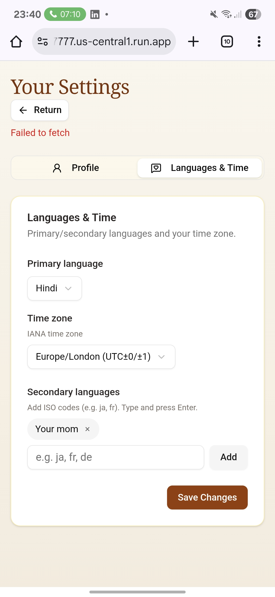
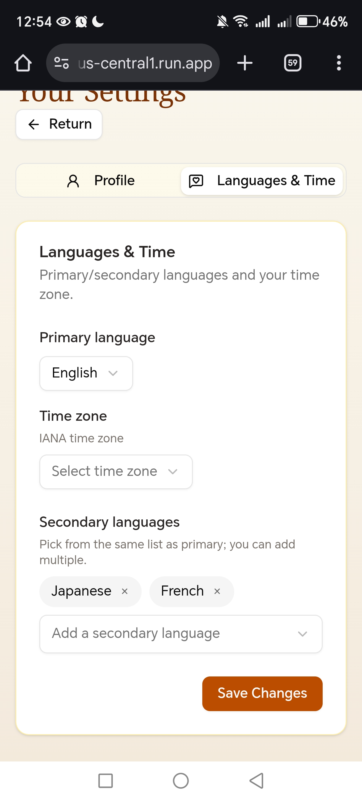
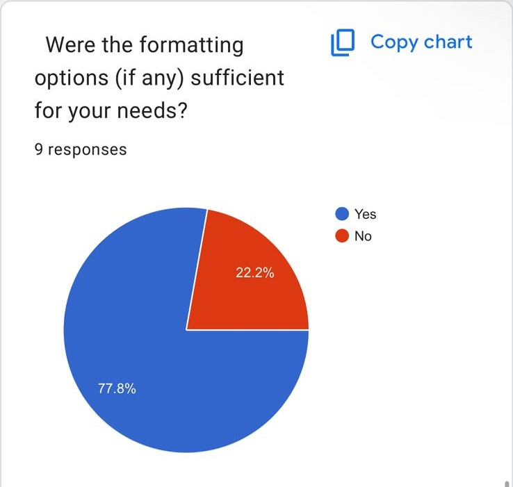
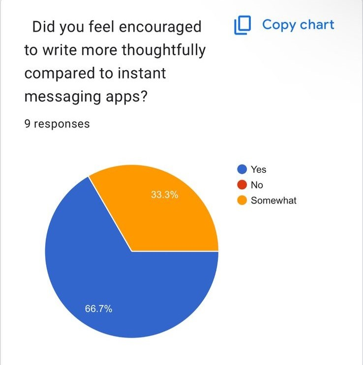
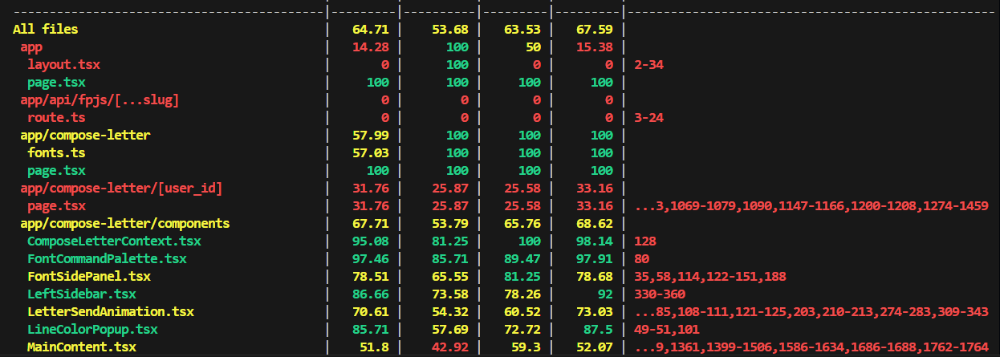
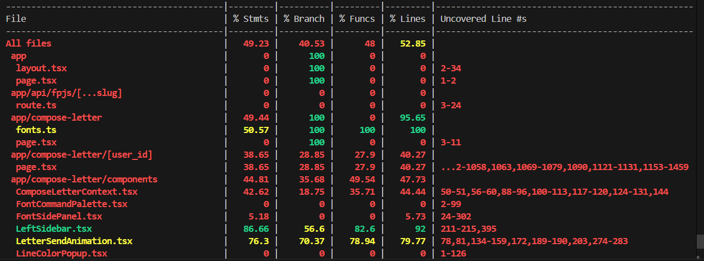
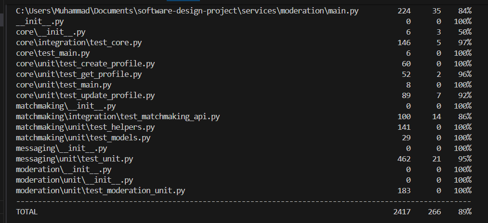

# Testing Strategy & Documentation

This document outlines our comprehensive testing strategy for the **Virtual Pen Pals** project. It covers current automated testing practices, plans for future integration tests, and our process for gathering and acting on user feedback.

---
## Why jest and pytest?

You'd use both Jest and Pytest because your codebase likely uses two different languages: **JavaScript/TypeScript** for the frontend and **Python** for the backend. Each framework is a best-in-class tool for its respective ecosystem. It's a "best tool for the job" approach.

### **Why Use Pytest for Your Python Backend**

Pytest is the standard for testing in the Python world for several key reasons. It's used to test things like your API logic, database interactions, and business rules.

* **Simple & Readable Tests**: Pytest allows you to use simple assert statements, which makes tests clean and easy to read. You don't need to learn a bunch of special assertSomething methods.  
  * *Example*: assert response.status\_code \== 200 is much cleaner than self.assertEqual(response.status\_code, 200).  
* **Powerful Fixtures**: This is Pytest's killer feature. **Fixtures** are functions that provide a fixed baseline of data or a system state (like a database connection or a logged-in user) for your tests. They are reusable, modular, and make managing test setup and teardown incredibly easy.  
* **Rich Plugin Ecosystem**: Pytest has a massive ecosystem of plugins. Need to test a Django or Flask app? There's a plugin for that (pytest-django, pytest-flask). Need to run tests asynchronously? There's a plugin for that (pytest-asyncio). This makes it highly extensible.  
* **Detailed Test Reports**: When a test fails, Pytest gives you incredibly detailed output that makes it much easier to debug what went wrong.

### **Why Use Jest for Your JavaScript/TypeScript Frontend**

Jest is the dominant testing framework in the JavaScript world, especially for applications built with frameworks like React, Vue, and Angular. It's used to test UI components, user interactions, and application state.

* **"Zero-Config" Experience**: For many projects (especially those started with create-react-app), Jest works out of the box with almost no setup required. It comes as a complete package with a test runner, assertion library, and mocking capabilities built-in.  
* **Built-in Mocking**: Testing frontend code often requires faking things like API calls, timers, or browser functions. Jest has a powerful and easy-to-use **mocking system** built right in, which is essential for isolating components for testing.  
* **Snapshot Testing**: This is a unique feature where Jest takes a "snapshot" of your UI component's rendered output. The test then checks if the component still renders the same way. If a change causes the snapshot to be different, the test fails, alerting you to an intended or unintended UI change. It's fantastic for preventing accidental UI regressions.  
* **Fast & Parallel**: Jest is known for its speed. It runs tests in parallel processes to finish even large test suites as quickly as possible, giving you fast feedback.

## Automated Testing

We use automated testing to ensure the quality and reliability of both our frontend and backend microservices. Our current focus is on **unit testing** to validate individual components and functions.

### Tools & Frameworks

* **Frontend — Jest**: Unit and integration tests for React components, functions, and helper modules in isolation.
* **Backend — pytest**: Unit and integration tests for Python-based microservices and API logic with a simple, scalable style.

### Unit Test Plan

Our unit test plan focuses on isolated testing of the smallest units of code.

#### Frontend Unit Tests

* **Component rendering**: Verify that components render correctly without errors.
* **Prop handling**: Ensure components correctly handle and display data passed via props.
* **State management**: Test that local state and state updates function as expected.
* **Helper functions**: Validate the logic of all utility and helper functions.

#### Backend Unit Tests

* **Function logic**: Confirm that individual functions return correct outputs for given inputs.
* **Database interactions (mocked)**: Verify that functions interacting with the database perform the correct queries, using mocked data to avoid reliance on a live database.

---

## Integration Testing Overview (Implemented)

These are the integration tests we **implemented** (not a future plan). On the frontend we used **MSW** to simulate backend behavior; in places with **no API calls**, we mocked the relevant components and verified how well they work together.

### What is MSW?

**Mock Service Worker (MSW)** intercepts network requests at the browser/fetch level during tests (and optionally during local dev) and serves deterministic, programmable responses. This lets us test real UI → network interactions without hitting a live backend, while still exercising request payloads, headers, error states, and loading flows.

### What we covered

#### UI → API Integration

* User actions (e.g., clicking **Send Message**) trigger the expected HTTP requests.
* MSW handlers assert request shape (method, path, body) and return success/error variants.
* The UI reacts correctly to each variant (loading states, toasts/errors, optimistic updates).

#### Microservice Communication (simulated)

* We modeled the **Matchmaking API** hand‑off via chained MSW handlers.
* Tests match when rendering the screen the user details show up correctly.

#### End‑to‑End User Flows

* Scenario tests simulate a user registering, finding a pen pal, sending a message, and receiving a reply—all via MSW responses that represent realistic backend behavior.
* Assertions focus on cross‑component state, navigation, and rendered content rather than implementation details.

#### When There Were No API Calls

* We **mocked collaborating components** (e.g., context providers, heavy widgets) and tested their **integration points**: props contracts, event callbacks, and shared state updates.
* These tests ensure multiple components still function correctly together even without network I/O.

---

## User Testing & Feedback

We maintain a formal user testing process to gather qualitative feedback on usability and to identify potential bugs.

### Feedback Collection Process

* **Survey distribution**: A Google Form is shared with a group of beta testers.
[This is an external link to our google form](https://docs.google.com/forms/d/10cfDYyo5fgt6F06BS2fH5IMsm67-RdC_Ie5k8KEF6nQ/edit?ts=68b5e3ed)
* **Guided usage**: Testers are instructed to use the application and explore its features.
* **Bug reporting**: The Google Form allows users to submit bugs to our GitHub Projects bug tracker.
* **Backlog integration**: We regularly review the bug tracker and add reported issues to the backlog for prioritization and resolution.

### Key Takeaways from User Feedback  

_Source documents: [Feedback Form](https://forms.gle/DK6JTrqMdmDxkoSEA) · [Responses Sheet](https://docs.google.com/spreadsheets/d/1ZpXSg8j9_GGlYAYpJe84VJe3fUFiin5dpz9dM-09f9k)_

#### UI & Landing Page Feedback  

* **Formatting options for letters** — **3/9** asked for this:  
  * Users want richer ways to write and decorate letters (e.g., fonts, templates, postcard-style UI).  
  * This would make letters more **meaningful** and fun.  

* **Landing page as a pain point** — **3/12** explicitly mentioned it:  
  * Rework the **hero** with cleaner text, consistent minimal imagery, and a CTA leading to an **About / “What GlobeTalk does”** page (not just login/sign-up).  
  * Improve cohesion so the first impression feels engaging and not “bare” or “boring.”  

* **UI design & color scheme** — **2/12** called this out:  
  * Comments included: “The colours” and “yellow background feels like an old website.”  
  * Users want a **more polished, cohesive design** that feels modern.  

## Takeaway

Prioritize a cleaner, more cohesive landing page: modernize colors, refine the hero, and route the CTA to value/overview first.

### Evidence
* **Beta tester submitted bug that is already closed**
    [Github bug proof](https://github.com/MuaazBayat/software-design-project/issues/100)
    .png)
* **Before user feedback integration**
    
* **After user feedback integration**
    
* **Useful user feedback data**
    
    
---

### Test snapshots as of 30 September
* **Frontend tests**
    
    
* **Backend tests**
    

---

### Continuous Integration & Quality Gates

### CI Integration
All Jest and Pytest jobs are automatically run by **GitHub Actions**.  
Each pull request triggers the following CI steps:
1. Lint and build checks  
2. Jest unit and integration tests (`npm test`)  
3. Pytest with coverage enforcement (`pytest --cov-fail-under=50`)  

Pull requests cannot be merged unless **all CI checks pass**, ensuring code quality and preventing regressions.

### Test Artifacts & Coverage Reports
The CI pipeline uploads coverage artifacts for both the frontend (`coverage/`) and backend (`htmlcov/`) after every successful test run.  
Minimum coverage thresholds (50%) are enforced; if coverage drops below this value, the workflow fails automatically.

